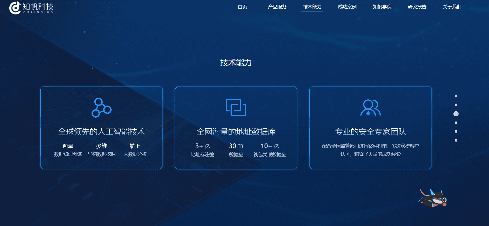

---
weight: 
title: "CHAINDIGG"
description: "CHAINDIGG 是全球领先的区块链大数据服务公司"
date: 2022-07-20T21:57:40+08:00
lastmod: 2022-07-20T16:45:40+08:00
draft: false
authors: ["MineW"]
featuredImage: "chaindigg.jpg"
link: "https://www.chaindigg.com/?t=_0.7450799013779659"
tags: ["区块链浏览器","CHAINDIGG"]
categories: ["navigation"]
navigation: ["区块链浏览器"]
lightgallery: true
toc: true
pinned: false
recommend: false
recommend1: false
---
CHAINDIGG 是全球领先的区块链大数据服务公司。致力于将大数据价值带给每个人，构建全球区块链数据生态价值平台。CHAINDIGG 在数字货币追踪监控，区块链大数据挖掘，数字货币投资决策领域为客户提供有价值，有竞争力，安全可信的数据解决方案。

北京知帆科技有限公司成立于2017年，是国内专注于区块链大数据分析的安全公司，也是提供虚拟货币追踪服务的专业公司，利用核心技术能力对区块链数据进行分析挖掘，帮助监管部门解决涉虚拟货币相关案件查证难题，知帆科技已与全国数百家监管部门建立合作，多次为客户提供技术支撑服务。

