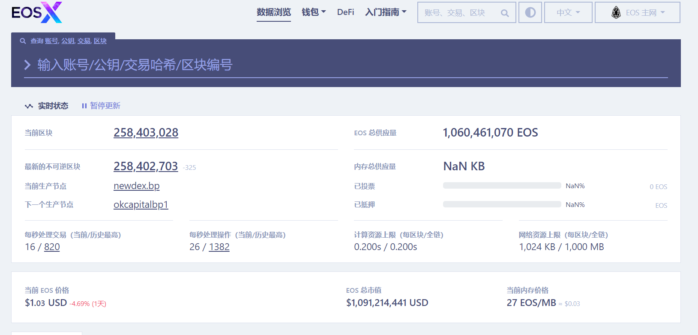

---
weight: 
title: "EOSX"
description: "EOSX是一款EOS浏览器，支持账号、公钥、交易哈希、区块编号进行搜索，并支持查看EOS的当前节点"
date: 2022-07-21T21:57:40+08:00
lastmod: 2022-07-21T16:45:40+08:00
draft: false
authors: ["MineW"]
featuredImage: "eosx.png"
link: "https://www.eosx.io/"
tags: ["区块链浏览器","EOSX"]
categories: ["navigation"]
navigation: ["区块链浏览器"]
lightgallery: true
toc: true
pinned: false
recommend: false
recommend1: false
---
EOSX是一款EOS浏览器，支持账号、公钥、交易哈希、区块编号进行搜索，并支持查看EOS的当前节点

‎EOS是用于分散式应用程序（dApps）的区块链平台。EOS具有类似操作系统的环境，消除了交易费用，目标是每秒支持数百万笔交易。EOS旨在为开发人员和最终用户提供可访问性，可扩展性和用户友好性。‎

‎要参与EOS平台，您需要一个‎**‎EOS帐户‎**‎。此帐户保存您的令牌，并允许您执行转移令牌，投票等操作。要执行这些操作，您的账户需要资源。在EOS中，这些资源是‎**‎RAM‎**‎，‎**‎CPU‎**‎和‎**‎NET‎**‎。浏览我们的指南以了解更多信息！‎

