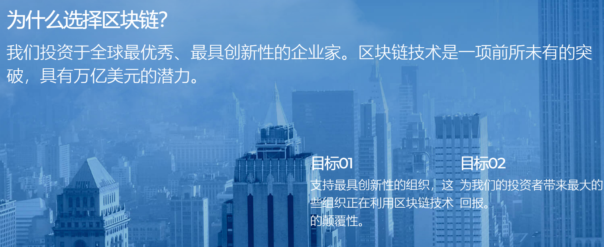

---
weight: 
title: "AlphaBlock"
description: "AlphaBlock 位于美国纽约，投资全球最优秀、最具创新精神的企业家，专注于区块链方向"
date: 2022-07-14T21:57:40+08:00
lastmod: 2022-07-14T16:45:40+08:00
draft: false
authors: ["MineW"]
featuredImage: "alphablock.png"
link: "https://alphablock.com/"
tags: ["投资机构","AlphaBlock"]
categories: ["navigation"]
navigation: ["投资机构"]
lightgallery: true
toc: true
pinned: false
recommend: false
recommend1: false
---
AlphaBlock 位于美国纽约，投资全球最优秀、最具创新精神的企业家，专注于区块链方向。

1、DeFi概念：从改良到革命，有望成为未来“加密世界”新主宰

去中心化金融服务（DeFi）成为2019年区块链行业的热门关键词，DeFi采用的区块链技术具有可溯源、不可篡改和高透明度的特性，是对目前金融行业的有益补充。后期随着DeFi的日渐成熟与区块链技术的迭代，DeFi将扮演更多、更重要的角色，甚至主导未来“加密世界”的金融体系也未可知。

根据DAppTotal的数据，DeFi 全行业的锁仓总值在 2019 年上半年持续攀升，一路从 2019 年 01 月 01 日的 3.02 亿美元飙升至 2019 年 06 月 30 日的 14.9 亿美元，半年时间增长近5倍。就数字货币借贷市场而言，锁仓总值从 2019 年 01 月 01 日的 2.78 亿美元飙升至 2019 年 06 月 30 日的5.22 亿美元，半年时间增长近2倍。市场发展如此快速的领域，必然涌入诸多有利的市场竞争者。Alpha Block Chain正是其中一股重要的力量。

DeFi概念产生以来，目前符合条件的区块链项目已有上千个。据Github，DeFi可分为分散交换协议、稳定通证、贷款协议、衍生协议/预测市场等。其中，绝大多数的DeFi类项目都基于Ethereum及少数几个公链进行开发。而就目前的技术迭代来讲，多数公链并不支持较高的TPS，这无疑会限制对交易速率要求较高的DeFi类项目的部署。

2、AlphaBlock Chain横空出世，打造去中心化金融垂直公链

AlphaBlock Chain将是一条图灵完备的支持智能合约二次开发的通用公链，公链将支持第三方基于Alpha Block Chain协议开发及运营子链，支持第三方为链上资产提供DeFi 服务。不同于其他区块链基础设施，Alpha Block Chain的最初构想就是为去中心化金融服务提供基础设施，因此AlphaBlock Chain更注重区块链在金融领域的应用，为传统资产合规上链，进入全球价值互联网，提升资产的流通及交易效率；将区块链的开放高效、分布式治理等特性引入传统金融系统进行新的价值网络升级，提升其运营效率。

AlphaBlock Chain核心特点及定位：

基于区块链的全球性去中心化金融服务基础设施
为去中心化金融应用提供智能合约、Bass及Dapps开发服务
提供高性能的链上交易，满足金融服务高性能要求
支持多数字资产发行与数字资产链上交易与管理
提供链上的合规及监管框架，全面深度支持合规及监管
支持第三方基于Alpha Block Chain协议开发及运营子链

3、Alpha Block Chain应用生态

Alpha Block Chain基于服务去中心化金融的构想而生，在实际的金融服务中，许多机构尤其是非银行机构和中小金融机构并不需要构建属于自身的公链系统，他们成为Alpha Block Chain的目标客户。Alpha Block Chain提供可靠、便利和廉价的去中心化金融基础设施以吸引目标客户使用Alpha Block Chain构建其应用，并最终形成大规模的应用生态。

相较于发达国家拥有完善的金融服务体系，发展中国家和落后国家的金融服务并不完善，甚至有广大的人群受限于金融服务费或基础设施的缺乏，并没有获得过金融服务。Alpha Block Chain将率先从该类市场出发，自主开发去中心化金融应用以解决该地区人民的基本金融需求问题，例如小额借贷和货币保值。在Alpha Block Chain主网上线前，Alpha Block Chain团队成员已经基于Ethereum和 Cosmos 开发过金融应用服务第三世界国家的小额资产借贷。

Alpha Block Chain生态建设需要经过长时间的努力，但其在去中心化金融领域的各项尝试将被代码永久记录，各生态应用也将相互借鉴并发展，最终走向成熟。

4、Alpha Block Chain合作项目——星际寻宝

星际寻宝是Alpha Block Chain合作的首个生态项目，是一款基于Ethereum开发的种植类社交游Dapp。星际寻宝游戏经济模型基于GARCH-ARMA设计，结合CryptoKitties等游戏成功经验，包含多种趣味游戏玩法，能够快速聚集人气并使用户获得收益。星际寻宝系统内游戏币及游戏数据在Alpha Block Chain主网上线后将全部映射至主网。作为Alpha BlockChain对星际寻宝游戏用户的回馈，星际寻宝游戏币将全部兑换上线后的主网代币，整体占主网币的20%。星际寻宝游戏币总量的5%将作为Alpha Block Chain生态奖励金，奖励给Alpha Block Chain生态应用开发者。

5、Alpha Block Chain发展规划

目前Alpha BlockChain仍然处于开发中，根据项目发布的白皮书1.0版本显示，AlphaBlock Chain主网预计2020年底上线并接入生态应用。