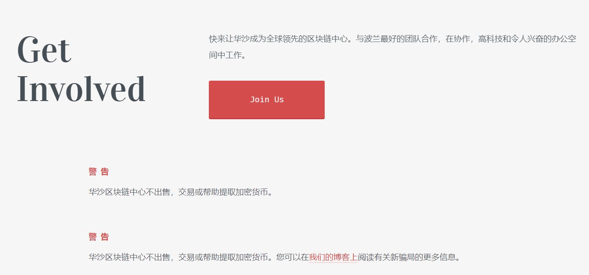

---
weight: 
title: "Blockchain Hub Warsaw"
description: "Blockchain Hub Warsaw，开放的波兰区块链社区，也自称是全球领先的区块链中心，成为连接全球的枢纽"
date: 2022-07-18T21:57:40+08:00
lastmod: 2022-07-18T16:45:40+08:00
draft: false
authors: ["MineW"]
featuredImage: "blockchain-hub-warsaw.jpg"
link: "https://bhwarsaw.org/"
tags: ["元宇宙社区","Blockchain Hub Warsaw"]
categories: ["navigation"]
navigation: ["元宇宙社区"]
lightgallery: true
toc: true
pinned: false
recommend: false
recommend1: false
---
Blockchain Hub Warsaw，开放的波兰区块链社区，也自称是全球领先的区块链中心，成为连接全球的枢纽。

###### ‎华沙区块链中心：‎

#### ‎波兰领先的区块链团队‎

#### ‎一个开放的社区，作为全球领先的区块链中心共同努力。‎

‎将区块链技术的未来构建为波兰领先项目，开发人员和团队的开放社区。‎

