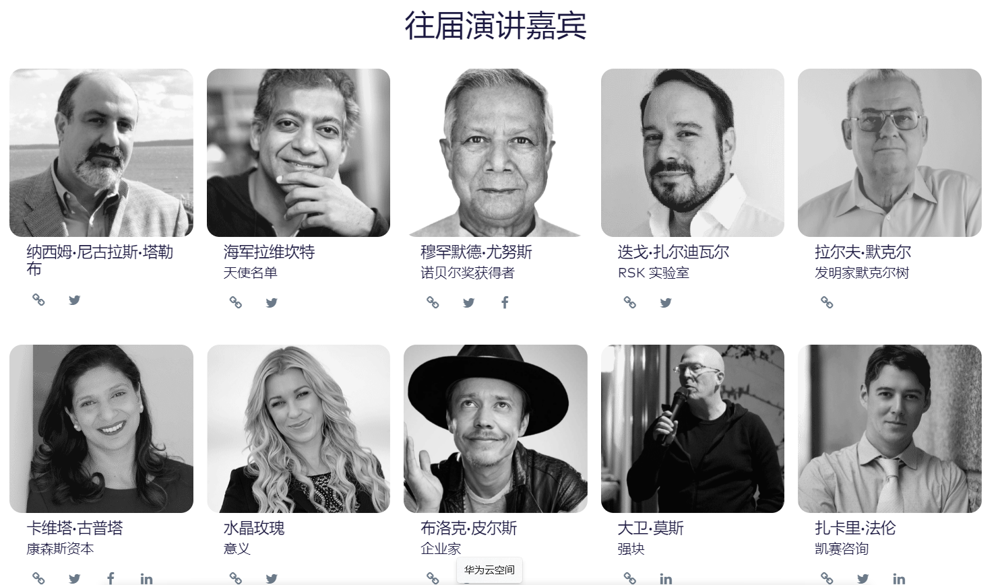

---
weight: 
title: "BLOCKCON"
description: "在洛杉矶举办的年度全球区块链峰会"
date: 2022-07-18T21:57:40+08:00
lastmod: 2022-07-18T16:45:40+08:00
draft: false
authors: ["MineW"]
featuredImage: "blockcon.jpg"
link: "https://www.goblockcon.com/"
tags: ["元宇宙社区","BLOCKCON"]
categories: ["navigation"]
navigation: ["元宇宙社区"]
lightgallery: true
toc: true
pinned: false
recommend: false
recommend1: false
---
在洛杉矶举办的年度全球区块链峰会。

\#BLOCKCON是101010（又名10/10 @ 10am）在圣莫尼卡举行的年度大会。它主要关注区块链技术，创新和影响。它面向所有人，从儿童到父母，学生，开发人员和企业高管，创始人和投资者。
