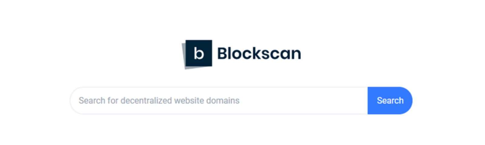

---
weight: 
title: "Blockscan"
description: "Blockscan区块链浏览器对Grin币进行实时监控，从货币信息图表、网络信息图表、矿工信息图表全面统计GRIN的数据"
date: 2022-07-18T21:57:40+08:00
lastmod: 2022-07-18T16:45:40+08:00
draft: false
authors: ["MineW"]
featuredImage: "blockscan.png"
link: "https://blockscan.com/"
tags: ["区块链浏览器","Blockscan"]
categories: ["navigation"]
navigation: ["区块链浏览器"]
lightgallery: true
toc: true
pinned: false
recommend: false
recommend1: false
---
Blockscan区块链浏览器对Grin币进行实时监控，从货币信息图表、网络信息图表、矿工信息图表全面统计GRIN的数据

 聊天 ·桥梁 ·发现 ·Bridges Discover 提交 Twitter TOS ‎*‎Blockscan‎*‎ © 2021 |❤ 由Etherscan背后的团队制作。‎

