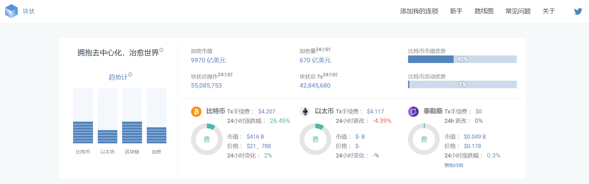

---
weight: 
title: "Block'tivity"
description: "区块链上交易处理能力的数据排名"
date: 2022-07-18T21:57:40+08:00
lastmod: 2022-07-18T16:45:40+08:00
draft: false
authors: ["MineW"]
featuredImage: "blocktivity.jpg"
link: "https://blocktivity.info/"
tags: ["数据分析","Block'tivity"]
categories: ["navigation"]
navigation: ["数据分析"]
lightgallery: true
toc: true
pinned: false
recommend: false
recommend1: false
---
区块链上交易处理能力的数据排名。

Blocktivity‎*网站上显示的数据反映了区块链和市场上正在发生的事情。

区块链的真正价值。考虑区块链项目的一种方法是通过其市值。另一种更接近实际价值的方法是观察区块链上的活动。许多FUD和HYPE都对加密货币领域的“错位”资本负责。在这里，我们正在观察哪个项目实际上被人们使用，在我们看来，这是您可以拥有的价值的最佳预测指标。

