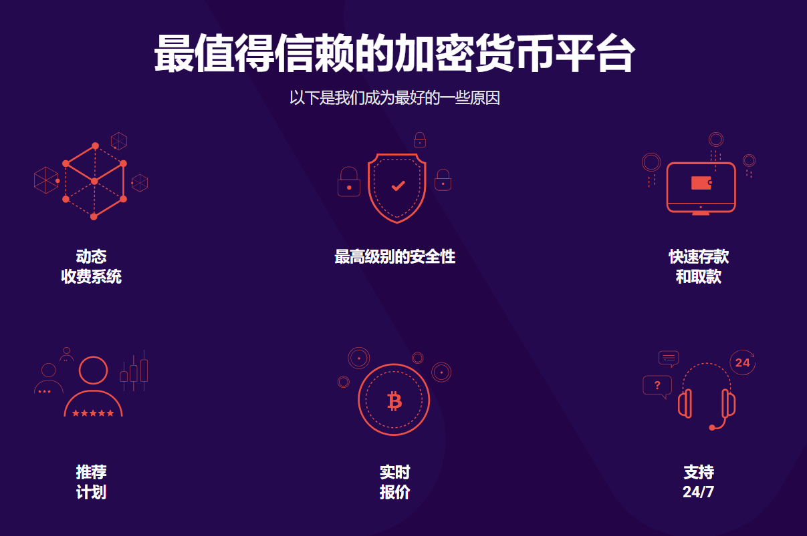

---
weight: 
title: "BTC Alpha"
description: "BTC-Alpha LTD于2016年11月1日正式上线，是美国的一家比特币国际站。目前只有42对交易对，支持法币交易。"
date: 2022-07-19T21:57:40+08:00
lastmod: 2022-07-19T16:45:40+08:00
draft: false
authors: ["MineW"]
featuredImage: "btc-alpha.webp"
link: "https://btc-alpha.com/en"
tags: ["交易所","BTC Alpha"]
categories: ["navigation"]
navigation: ["交易所"]
lightgallery: true
toc: true
pinned: false
recommend: false
recommend1: false
---
BTC-Alpha LTD于2016年11月1日正式上线，是美国的一家比特币国际站。目前只有42对交易对，支持法币交易。

Alpha-Code是一种在BTC-Alpha用户帐户之间转移资产的工具。
我们创建了Alpha-Code，以使您对BTC-Alpha加密交换
的体验尽可能方便，舒适，最重要的是 - 安全！

‎什么是阿尔法比特币？‎

‎BTC-Alpha是‎**‎一个加密货币交易平台，为初学者和专业人士提供先进的金融服务‎**‎。他们的平台是一个可靠，安全和稳定的加密交易环境，佣金低廉，24小时客户支持。‎

