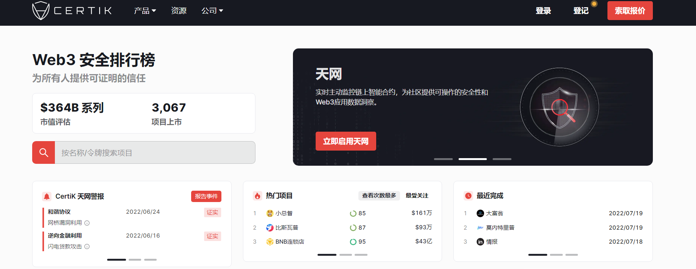

---
weight: 
title: "CertiK"
description: "CertiK是一家智能合同及区块链生态安全服务提供商，采用了形式化的验证，将智能合约转化为数学模型，通过逻辑上的推理演算来验证模型，从而证明智能合约的安全性，核心产品为Certi..."
date: 2022-07-20T21:57:40+08:00
lastmod: 2022-07-20T16:45:40+08:00
draft: false
authors: ["MineW"]
featuredImage: "certik.jpg"
link: "https://www.certik.com/"
tags: ["安全机构","CertiK"]
categories: ["navigation"]
navigation: ["安全机构"]
lightgallery: true
toc: true
pinned: false
recommend: false
recommend1: false
---
CertiK是一家智能合同及区块链生态安全服务提供商，采用了形式化的验证，将智能合约转化为数学模型，通过逻辑上的推理演算来验证模型，从而证明智能合约的安全性，核心产品为CertiKOS防黑客操作系统。

CertiK由哥伦比亚大学和耶鲁大学的教授于2018年创立，是区块链安全的先驱，利用一流的形式验证和人工智能技术来保护和监控区块链，智能合约和Web3应用程序。

*‎CertiK‎*‎是领先的以安全为中心的排名平台，用于分析和监控区块链协议和DeFi项目。‎

