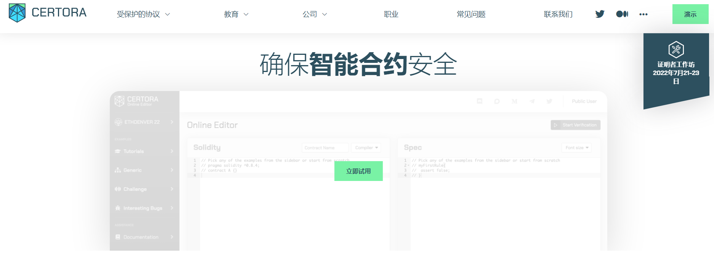

---
weight: 
title: "Certora"
description: "CertCertora 通过智能合约的全自动精确验证技术，使可信区块链成为现实"
date: 2022-07-20T21:57:40+08:00
lastmod: 2022-07-20T16:45:40+08:00
draft: false
authors: ["MineW"]
featuredImage: "certora.jpg"
link: "https://www.certora.com/"
tags: ["安全机构","Certora"]
categories: ["navigation"]
navigation: ["安全机构"]
lightgallery: true
toc: true
pinned: false
recommend: false
recommend1: false
---
CertCertora 通过智能合约的全自动精确验证技术，使可信区块链成为现实。其验证方法易于使用且具有成本效益。

Certora提供独特的技术来保证代码的正确性和安全性8

‎Certora‎**‎通过应用模块化形式验证来确保智能合约的正确性‎**‎。‎

Certora提供可访问且具有成本效益的智能合约形式验证。Certora的自动精确验证（AEV）技术补充了现有的智能合约编译器和调试器，并检查智能合约的所有执行是否满足一组要求。独立于区块链且与语言无关，Certora的AEV技术可以精确识别或验证智能合约中是否存在错误。

