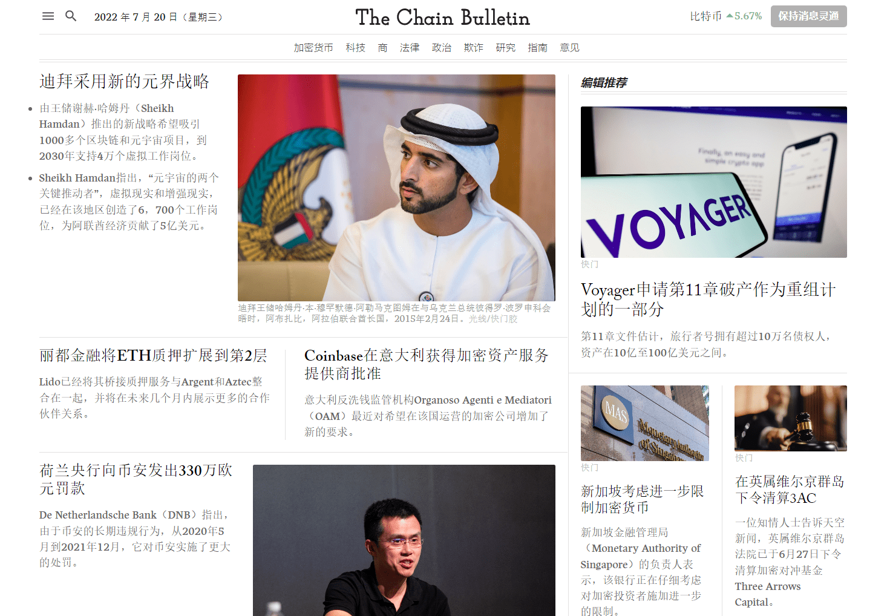

---
weight: 
title: "ChainBulletin"
description: "ChainBulletin 是快速兴起的区块链新闻聚合，其使命是全天候提供区块链新闻、分析和研究，并编写了深入的区块链指南"
date: 2022-07-20T21:57:40+08:00
lastmod: 2022-07-20T16:45:40+08:00
draft: false
authors: ["MineW"]
featuredImage: "chainbulletin.jpg"
link: "https://chainbulletin.com/"
tags: ["元宇宙资讯","ChainBulletin"]
categories: ["navigation"]
navigation: ["元宇宙资讯"]
lightgallery: true
toc: true
pinned: false
recommend: false
recommend1: false
---
ChainBulletin 是快速兴起的区块链新闻聚合，其使命是全天候提供区块链新闻、分析和研究，并编写了深入的区块链指南。相信这也是生态系统目前所缺乏和迫切需要的。

*‎《区块链公报》‎*‎涵盖了区块链的突发新闻，分析和研究了行业，撰写了权威指南，并提供了专家意见。‎

