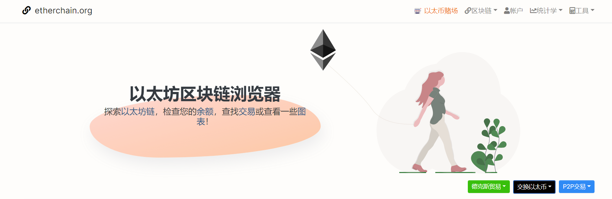

---
weight: 
title: "etherchain.org"
description: "以太坊区块链资源管理器，掌控以太坊的实时信息，满足用户搜索需求"
date: 2022-07-21T21:57:40+08:00
lastmod: 2022-07-21T16:45:40+08:00
draft: false
authors: ["MineW"]
featuredImage: "etherchain-org.png"
link: "https://www.etherchain.org/"
tags: ["区块链浏览器","etherchain.org"]
categories: ["navigation"]
navigation: ["区块链浏览器"]
lightgallery: true
toc: true
pinned: false
recommend: false
recommend1: false
---
以太坊区块链资源管理器，掌控以太坊的实时信息，满足用户搜索需求

##### 探索[以太坊链](https://etherchain.org/blocks)，检查您的[余额](https://etherchain.org/accounts)，查找[交易](https://etherchain.org/txs)或查看一些[图表](https://etherchain.org/charts)！

