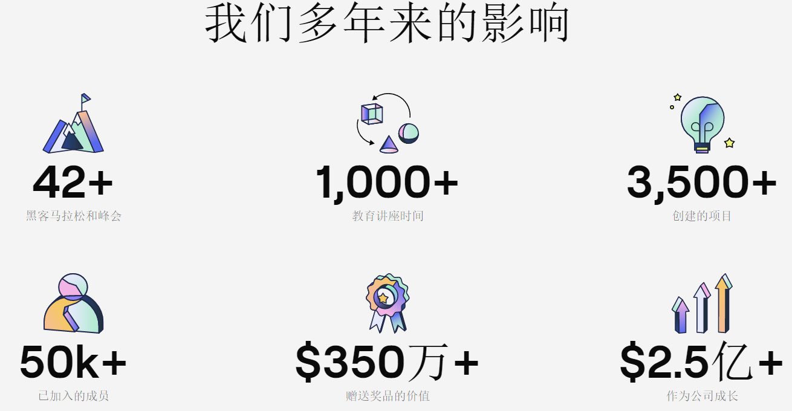

---
weight: 
title: "ETHGlobal"
description: "ETHGlobal 利用团队组织 ETHWaterloo、Hack the North 的经验，培养世界级的以太坊开发商与企业家生态系统，共同构建 Web 3.0 世界"
date: 2022-07-21T21:57:40+08:00
lastmod: 2022-07-21T16:45:40+08:00
draft: false
authors: ["MineW"]
featuredImage: "ethglobal.jpg"
link: "https://ethglobal.com/"
tags: ["元宇宙社区","ETHGlobal"]
categories: ["navigation"]
navigation: ["元宇宙社区"]
lightgallery: true
toc: true
pinned: false
recommend: false
recommend1: false
---
ETHGlobal 利用团队组织 ETHWaterloo、Hack the North 的经验，培养世界级的以太坊开发商与企业家生态系统，共同构建 Web 3.0 世界。为了实现其目标，ETHGlobal 在全球组织黑客马拉松，每年都会主持主要的一场，以加强开发者社区，提供专业知识帮助，同时突破新的技术极限，协助管理 API 工具集，以及帮助区块链领域的主要演讲者、评委、赞助商等等。

黑客马拉松教授新技能，加强开发人员社区，并推动新技术的极限。在ETHGlobal，我们正在利用我们多年的经验来培育一个由以太坊开发人员和企业家组成的世界级生态系统。

